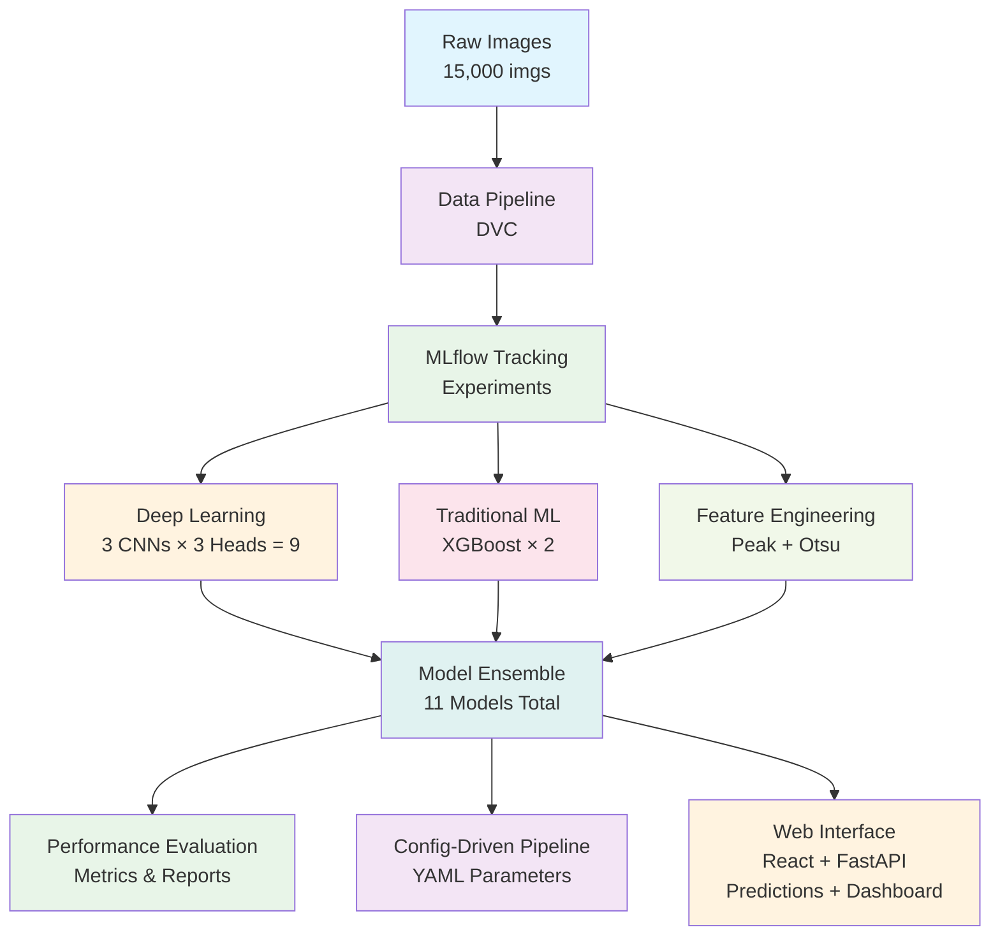

# 🗑️ Waste Classification - Advanced ML Pipeline

> **Production-ready ML engineering system** comparing 11 model architectures across 30 waste categories with 92.7% accuracy, featuring MLOps practices, interactive web interface, and comprehensive experiment tracking.

---

## 🎯 Problem Statement

Waste management facilities struggle with **inefficient manual sorting** leading to high contamination rates and reduced recycling effectiveness. Automated classification systems need to be:
- **Highly accurate** across diverse waste categories
- **Computationally efficient** for real-time deployment
- **Scalable** to handle large volumes of waste
- **Interpretable** for operational trust

This solution delivers **industrial-grade waste classification** through rigorous model comparison, advanced feature engineering, and MLOps best practices.

---

## 🏗️ Architecture Overview



---
### Deep Learning Models (9 Configurations)
```
ResNet50 × 3 Head Complexities:
├── Simple Head (1 Dense layer)
├── Semi-Complex Head (2 Dense layers) ← **Best: 92.7% accuracy**
└── Complex Head (3 Dense layers)

MobileNetV2 × 3 Head Complexities:
├── Simple Head
├── Semi-Complex Head
└── Complex Head

EfficientNet-B0 × 3 Head Complexities:
├── Simple Head
├── Semi-Complex Head
└── Complex Head
```

### Traditional ML Models (2 Variants)
- **XGBoost + Peak Local Max Features**: Spatial feature extraction
- **XGBoost + Multi-Otsu Histogram RGB**: Color-based features

---

## 🛠️ Technology Stack

| Component | Technology | Purpose |
|-----------|------------|---------|
| **Deep Learning** | PyTorch + Torchvision | CNN model training and inference |
| **Traditional ML** | XGBoost + Scikit-learn | Gradient boosting and utilities |
| **Feature Engineering** | Scikit-image + OpenCV | Advanced image processing |
| **MLOps** | DVC + MLflow | Data versioning and experiment tracking |
| **Backend API** | FastAPI + Uvicorn | High-performance REST API |
| **Frontend** | React + Material-UI | Modern web interface |
| **Containerisation** | Docker + Docker Compose | Production deployment |
| **Package Management** | UV | Fast Python dependency management |

---

## 🎯 Waste Categories (30 Types)

### Material Groups
- **Metal** (3): Aluminum cans, steel cans
- **Plastic** (8): Bottles, containers, bags, straws, lids
- **Glass** (3): Beverage bottles, cosmetic containers, food jars
- **Paper** (6): Cardboard, newspaper, magazines, office paper, cups
- **Organic** (4): Food waste, coffee grounds, eggshells, tea bags
- **Other** (6): Clothing, shoes, cutlery, styrofoam, aerosol cans

---

## 🚀 Quick Start

### Option 1: ML Pipeline Only
```bash
# Clone and setup
git clone https://github.com/grzegorz-gomza/Waste_Classifier.git
cd Waste_Classifier

# Install dependencies (UV recommended)
uv sync

# Run complete pipeline (4 stages)
uv run python main.py
# Select option 4 for full pipeline

# Make predictions
uv run python predict.py --image path/to/waste.jpg
```

### Option 2: Full Web Application
```bash
# Build and start all services
docker-compose up --build

# Access interfaces
# Frontend: http://localhost:3000
# Backend API: http://localhost:8000
# API Documentation: http://localhost:8000/docs
```

### Pipeline Stages
1. **Data Ingestion** - Download and prepare 15,000 images
2. **Model Preparation** - Initialize 11 model architectures
3. **Training** - Train all models with config-driven parameters
4. **Evaluation** - Comprehensive comparison and report generation

---

## ⚙️ Configuration Management

### Training Parameters (`params.yaml`)
```yaml
# Image preprocessing
IMAGE_SIZE: [224, 224, 3]
BATCH_SIZE: 64
TEST_SPLIT: 0.2

# Data augmentation
AUGMENTATION: True
RANDOM_FLIP: True
RANDOM_ROTATION: 0.3
RANDOM_ZOOM: 0.3

# Model configurations
DL_MODELS: [resnet50, mobilenet_v2, efficientnet_b0]
PRETRAINED: True
FREEZE_BASE: True
LEARNING_RATE: 0.0005
EPOCHS: 20
OPTIMIZER: 'adamw'
WEIGHT_DECAY: 0.01

# XGBoost parameters
XGB_RANDOM_STATE: 42
XGB_NUM_BOOST_ROUND: 300
XGB_MAX_DEPTH: 20
XGB_ETA: 0.1
```

---

## 📈 Comprehensive Evaluation

### Automated Report Generation
```
artifacts/reports/2024_03_19_14_30/
├── accuracy_comparison.png          # Model ranking
├── metrics_comparison.png          # Precision/Recall/F1
├── per_class_performance.png       # Category heatmap
├── confusion_matrix_*.png          # Individual matrices
├── evaluation_metrics.json         # Detailed metrics
├── training_parameters.json        # Config used
└── performance_summary.txt         # Human-readable report
```

### Key Metrics Tracked
- **Per-class accuracy** for each waste category
- **Confusion matrices** for error analysis
- **Training curves** (loss/accuracy progression)
- **Model efficiency** (inference time, memory usage)
- **Feature importance** for XGBoost models

---

## 🌐 API Interface

### Model Management Endpoints
```bash
# List all available models
GET /api/v2/models

# Get model performance metrics
GET /api/v2/runs/resnet50_semi_complex

# Make predictions
POST /api/v2/predictions
Content-Type: multipart/form-data
{
  "run_id": "resnet50_semi_complex",
  "file": <image_file>
}
```

### Response Format
```json
{
  "predictions": [
    {
      "class": "plastic_soda_bottles",
      "confidence": 0.927,
      "category": "Plastic"
    }
  ],
  "model_info": {
    "name": "ResNet50 Semi-Complex",
    "accuracy": 0.927,
    "inference_time_ms": 45
  }
}
```

---

## 💼 Why This Matters for Employers

This project demonstrates **advanced ML engineering capabilities**:

1. **Model Architecture Design**: CNN comparison and head complexity analysis
2. **MLOps Maturity**: DVC data versioning, MLflow experiment tracking
3. **Performance Optimization**: 92.7% accuracy through systematic tuning
4. **Production Deployment**: Docker, FastAPI, React integration
5. **Feature Engineering**: Advanced image processing techniques
6. **Comprehensive Evaluation**: Rigorous model comparison methodology

**Relevant for roles**: ML Engineer, Computer Vision Engineer, MLOps Engineer, Data Scientist

---

## 🔧 Advanced Features

### Design Pattern Implementation
- **Strategy Pattern**: Multiple model training strategies
- **Factory Pattern**: Model creation and configuration
- **Pipeline Pattern**: Data processing workflow
- **Observer Pattern**: Training progress monitoring

### Custom Feature Engineering
```python
# Peak Local Max for spatial features
peak_features = peak_local_max(image, min_distance=1, threshold_abs=30)

# Multi-Otsu for color histogram segmentation
thresholds = threshold_multiotsu(image_rgb, classes=8)
hist_features = []
for i in range(len(thresholds) + 1):
    mask = np.logical_and(image_rgb >= thresholds[i-1] if i > 0 else 0,
                        image_rgb < thresholds[i] if i < len(thresholds) else 255)
    hist_features.append(np.histogram(image_rgb[mask], bins=256)[0])
```

---

## 🔮 Future Enhancements

- [ ] **Model Optimization**: TensorRT deployment for edge computing
- [ ] **Active Learning**: Intelligent sample selection for continuous improvement
- [ ] **Multi-modal Input**: Combine visual with weight and sensor data
- [ ] **Edge Deployment**: Mobile app for on-site classification
- [ ] **Explainability**: Integrated Grad-CAM visualizations
- [ ] **Production Monitoring**: Real-time performance and drift detection

---

## 📁 Repository Structure

```
Waste_Classifier/
├── src/WasteClassifier/              # Core ML pipeline
│   ├── components/
│   │   ├── deep_learning/           # CNN implementations
│   │   └── machine_learning/        # XGBoost models
│   └── pipeline/                     # Orchestration logic
├── app/
│   ├── backend/                     # FastAPI application
│   └── frontend/                    # React interface
├── artifacts/                       # Model outputs and reports
├── mlruns/                         # MLflow experiment data
├── params.yaml                     # Training configuration
├── docker-compose.yml              # Container orchestration
└── main.py                        # Pipeline entry point
```

---

## 📄 License

MIT License 
